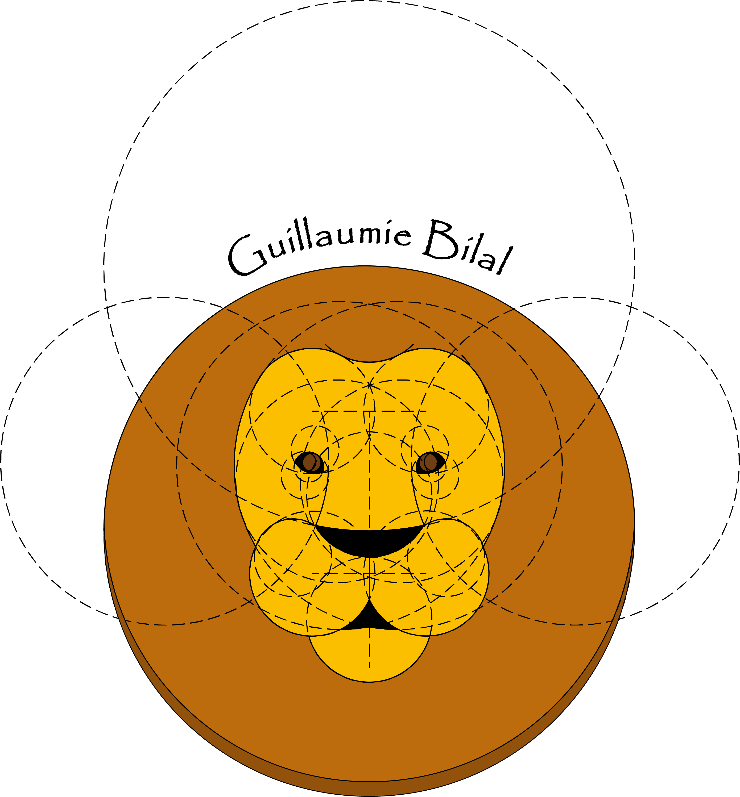

### Hi there 👋,
### I'm Babidiii
<!---->
<a href="https://portfolio.bilal-g.now.sh/">

</a>
  

[](https://github.com/Babidiii)

```javascript
class Babidiii {
    static instance;
    skills = [ 🤔 ] 
    
    constructor() {
        if (instance) {
            return instance;
        }
        this.instance = this;
    }

    fullStackFullStock = () =>{
        let i=0;
        while(true){
          this.code(this.skills);
          this.workout();
          this.sleep();
        }
    }
  ...
}
const me = new Babidiii();
me.fullstackFullstock();
```

<p align="center">
  <samp>
     :notebook: Currently working on an Nest Api CS <br>
    :email:	bilal.guillaumie@gmail.com <br>
    :briefcase: LinkedIn: www.linkedin.com/in/bilal-guillaumie-104069187 <br>
    :art: Portfolio: https://portfolio.bilal-g.now.sh/ </br>
  </samp>
</p>
