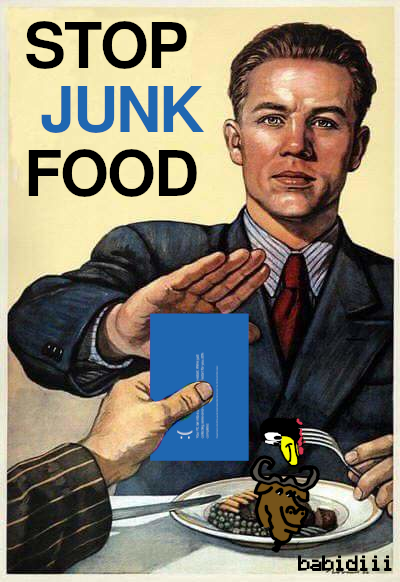

<p align="center">
  
  
</p>

  
```go
package main                                
                                            
import (                                    
  "work"                                    
  "rest"                                    
  "time"                                    
  "math/rand"                               
)                                           
                                            
func FullStHackFullStock() {                 
  while true {                              
    rest.Eat()                              
    work.Code(rand.Intn(4) * time.Hour)     
    rest.Eat()                              
    work.Code(rand.Intn(4) * time.Hour)     
    rest.Eat()                              
    rest.Pause(rand.Intn(60) * time.Minute) 
    work.Bodybuilding()                     
    rest.Eat()                              
    rest.Sleep(8 * time.Hour)               
  }                                         
}                                           
```

<p align="center">
  
</p>

<div align="center">

| Portfolio                                                                    |
|------------------------------------------------------------------------------|
| <a href="http://bgll.fullstackfullstock.com">bgll.fullstackfullstock.com</a> |
  
</div>

<div align="center">

</div>


